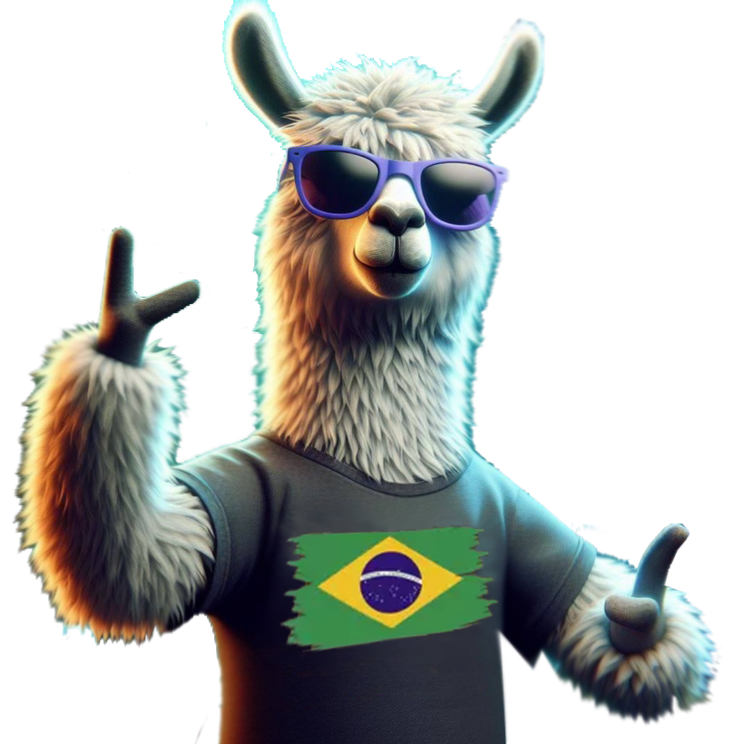

<h1>
  
🧠 Open Web Ui Prompt Templates</h1>

🇧🇷 Templates that change by system prompt on Ollama models to portuguese language. 🇧🇷

All templates below were tested with 16GB of memory, you can use these templates on CPU, ROCm GPU, or CUDA GPU.

---

## Ollama Models Used on this prompts
A list of all models that I use on Ollama with AMD ROCm 16GB GPU
- openchat:7b-v3.5-1210-q5_K_M
- dolphin-mixtral:8x7b-v2.7-q4_K_M
- llama3:8b-instruct-q6_K
- dolphin-llama3:8b-256k-v2.9-q6_K
- deepseek-coder:6.7b-instruct-q8_0
- orca2:13b-q4_K_M
- qwen:14b-chat-v1.5-q4_K_M
- promptengineer48/biomistral
- llava:13b

---

In [this repository](https://www.openwebui.com/m/hotnikq/), you will find a variety of prompts that can be used with [OpenWebUi](https://openwebui.com/). We encourage you to add your own prompts to the list, and to use Ollama to generate new prompts as well.

To get started, simply clone this repository and use the prompts. You can also use the prompts in this file as inspiration for creating your own.

We hope you find these prompts useful and have fun using Ollama!

---

- [Openai Chat Gpt 3.5 Leitor De Pdf](https://openwebui.com/m/hotnikq/openai-chat-gpt-3-5-leitor-de-pdf)

Leia longos arquivos PDF dentro do Ollama com este dispositivo

[Clear Prompt](https://github.com/hqnicolas/OpenWebUiPromptTemplates/blob/main/ModelFiles/Modelfile-OpenaiChatGpt35LeitordePdf.txt)

> FROM openchat:7b-v3.5-1210-q5_K_M

---

- [Facebook Meta Chat Llama 3 Em Portugues](https://openwebui.com/m/hotnikq/meta-chat-llama-3-em-portugues:latest)

Pergunte ao LLama

[Clear Prompt](https://github.com/hqnicolas/OpenWebUiPromptTemplates/blob/main/ModelFiles/Modelfile-FacebookMetaChatllama3emPortugues.txt)

> FROM llama3:8b-instruct-q6_K

---

- [Pequeno Golfinho Llama 3 Em Portugues](https://openwebui.com/m/hotnikq/pequeno-golfinho-llama3-em-portugues:latest)

Golfinho com conjunto de dados filtrado para remover alinhamento e tendência.

[Clear Prompt](https://github.com/hqnicolas/OpenWebUiPromptTemplates/blob/main/ModelFiles/Modelfile-PequenoGolfinhollama3emPortugues.txt)

> FROM dolphin-llama3:8b-256k-v2.9-q6_K

---

- [Chat Com Maria Do Alibaba Portugues](https://openwebui.com/m/hotnikq/maria-alibaba-portugues:latest)

Clear Prompt

13 bilhões de parâmetros para simplesmente conversar.

[Clear Prompt](https://github.com/hqnicolas/OpenWebUiPromptTemplates/blob/main/ModelFiles/Modelfile-ChatcomMariadoAlibabaPortugues.txt)

> FROM qwen:14b-chat-v1.5-q4_K_M

---

- [Mestre De Biologia Em Portugues](https://openwebui.com/m/hotnikq/mestre-de-biologia-em-portugues:latest)

BioMistral: uma coleção de grandes modelos de linguagem pré-treinados de código aberto para domínios

[Clear Prompt](https://github.com/hqnicolas/OpenWebUiPromptTemplates/blob/main/ModelFiles/Modelfile-MestredeBiologiaemPortugues.txt)

> FROM promptengineer48/biomistral

---

- [Professor De Biologia Em Portugues](https://openwebui.com/m/hotnikq/professor-de-biologia-em-portugues:latest)

modelo criado para estudar medicina e biologia usando OpenAi GPT3.5

[Clear Prompt](https://github.com/hqnicolas/OpenWebUiPromptTemplates/blob/main/ModelFiles/Modelfile-ProfessordeBiologiaemPortugues.txt)

> FROM openchat:7b-v3.5-1210-q5_K_M

---

- [Orca do microsoft Word em Português](https://openwebui.com/m/hotnikq/microsoft-orca-2-portugues:latest)

Tudo o que você pode esperar de uma iA da microsoft "Orca2" focada em leitura de arquivos do Word, Excel e Powerpoint.

[Clear Prompt](https://github.com/hqnicolas/OpenWebUiPromptTemplates/blob/main/ModelFiles/Modelfile-OrcadoMicrosoftWordemPortugues.txt)

> FROM orca2:13b-q4_K_M

---

- [Golfinho Do Software Em Português](https://openwebui.com/m/hotnikq/golfinho-do-software-em-portugu%C3%AAs:latest)

dolphin mixtral aguardando para falar português, fale sobre lógica e MagiCoder

[Clear Prompt](https://github.com/hqnicolas/OpenWebUiPromptTemplates/blob/main/ModelFiles/Modelfile-GolfinhodoSoftwareemPortugues.txt)

> FROM dolphin-mixtral:8x7b-v2.7-q4_K_M

---

- [Leitor De Imagens Llava Em Português](https://openwebui.com/m/hotnikq/leitor-de-imagens-llava-em-portugues:latest)

modelo de linguagem interpretador de Imagens que fala português.

[Clear Prompt](https://github.com/hqnicolas/OpenWebUiPromptTemplates/blob/main/ModelFiles/Modelfile-LeitordeImagensllavaemPortugues.txt)

> FROM llava:13b

---

- [Professor De Linguagem C ++ Em Português](https://openwebui.com/m/hotnikq/professor-de-linguagem-c++:latest)

Mentor de aulas para C++ em português

[Clear Prompt](https://github.com/hqnicolas/OpenWebUiPromptTemplates/blob/main/ModelFiles/Modelfile-ProfessordeLinguagemCPlusemPortugues.txt)

> FROM openchat:7b-v3.5-1210-q5_K_M

---

- [Professor De Linguagem Java Em Portugues](https://openwebui.com/m/hotnikq/professor-de-linguagem-java-em-portugues:latest)

Mentor de aulas para Java em português

[Clear Prompt](https://github.com/hqnicolas/OpenWebUiPromptTemplates/blob/main/ModelFiles/Modelfile-ProfessordeLinguagemJavaemPortugues.txt)

> FROM deepseek-coder:6.7b-instruct-q8_0

---

## Extra Ollama Models

- codeqwen:7b-code-v1.5-q8_0

---

## GGUF
Dont use system prompt on GGUF models

Dont use templates prompt on GGUF models

---

- [Claude Alpaca GGUF](https://openwebui.com/m/hotnikq/claudio-pacas-english:latest)

Download https://huggingface.co/TheBloke/claude2-alpaca-13B-GGUF/tree/main

> FROM /root/.ollama/models/claude2-alpaca-13b.Q8_0.gguf

---

